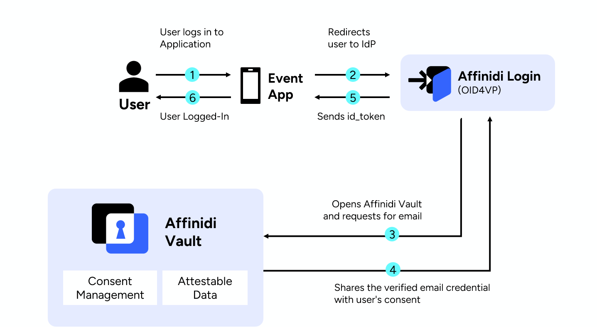

# Module 1: Setup Event Ticket Management application with Affinidi Login Using Affinidi CLI

In this workshop module, you'll create a baseline application code that serves as the foundation for integrating open identity protocols. You'll complete the local environment and application setup to ensure a consistent baseline across all participants before diving into further integrations.

By the end of this module, you will have an application setup with Affinidi Login on your local dev environment to proceed with next steps of the workshop.

## Introduction

Using the `generate-app` feature of Affinidi CLI, you’ll quickly set up the app’s baseline code, complete with the ticket management workflow and scaffolding for passwordless authentication using W3C Verifiable Credentials (VCs) — an open standard for secure, portable, digitally signed data that helps to establish transitive trust - verify once and use it anywhere. No more repeated OTPs or centralised password managers!

Every app needs trusted user onboarding to build a relationship. In this module, you'll learn how verifying a user's email once can enhance sign-up experiences, improving on social logins. This method extends to other onboarding data, reusing attested facts with no extra changes—just leveraging the OIDC library in your React app for a seamless experience. The decentralized data store provides a user-friendly, confidential storage solution that handles verified user data & self-expressed Zero Party Data, all transported via existing OIDC tools & libraries with minimal app changes.

## Architecture



## What you will experience

## Steps to complete application setup

| S.No | Content                                                                                            | Description                                                 |
| ---- | -------------------------------------------------------------------------------------------------- | ----------------------------------------------------------- |
| 1.   | [Setup development environment](#1-setup-development-environment)                                  | Complete the setup for Affinidi Vault and Affinidi CLI |
| 2.   | [Install & Initiatlise Dev Tools - Affinidi CLI](#2-install--initiatlise-dev-tools---affinidi-cli) | Install latest version of Affinidi CLI                      |
| 3.   | [Generate Eventi App](#3-generate-eventi-app)                                              | Generate Eventi App using Affinidi CLI                      |
| 4.   | [Run & Test the application](#4-test-the-newly-generated-eventi-app)                                          | Run & test the consumer onboarding on Eventi application by accessing attested personal information from the Affinidi Vault                                          |

<hr/>

### 1. Setup development environment

To complete this workshop, you would require few tools as listed below.

- Setup [Affinidi Vault](https://docs.affinidi.com/docs/get-started/#create-an-affinidi-vault-account) account to manage your digital identity for this workshop.
- [NodeJs v18 and higher](https://nodejs.org). (it's recommended to use [nvm](https://github.com/nvm-sh/nvm)).
- Install [Git](https://git-scm.com/) to generate a reference app using [affinidi generate app](https://docs.affinidi.com/dev-tools/affinidi-cli/generate-app/) command.
- [VS Code](https://code.visualstudio.com/) or similar local IDE for development.

  

> [!NOTE]
> For the best experience, we recommend using VS Code for this workshop. The content has been tested with a local VS Code setup on both Mac and Windows, ensuring everything works smoothly across both platforms. However, if you're more comfortable with a Cloud IDE, feel free to explore it, keeping in mind that the setup process might differ from the guided instructions. 

<hr/>

### 2. Install & Initiatlise Dev Tools - Affinidi CLI

#### Install the latest version of Affinidi CLI.

```sh
npm install -g @affinidi/cli
```

<details>
<summary>Troubleshooting if required</summary>

If you face any error, its recommended to start with a clean state by uninstalling the previous versions and then reinstalling the latest version

Uninstall the Affinidi CLI on your machine.

```sh
npm uninstall -g @affinidi/cli
npm install -g @affinidi/cli
```

</details>

#### Initialise Affinidi CLI 

Accessing most Affinidi CLI features, like creating a Login Configuration, requires you to authenticate to Affinidi using Affinidi Vault. To do this, you can execute the following command.

```sh
affinidi start
```

For More details refer to the [Affinidi CLI](https://docs.affinidi.com/dev-tools/affinidi-cli/#understanding-commands) Documentation

If you received a `session expired` error, just run the same command to refresh your session.
<hr/>

### 3. Generate Eventi App

```sh
affinidi generate app --provider=affinidi --framework=usecase --library=eventi --path=affinidi-eventi-app
```

> More about the `generate app` command in [this documentation](https://docs.affinidi.com/dev-tools/affinidi-cli/generate-app/).

> [!NOTE]
> Eventi application's `.env` file will be automatically updated with the following configuration variables

Follow the guided wizard as illustrated below in the CLI to setup the application with the default configuration for this workshop: 

<pre><code>
Generating sample app... Generated successfully!
? Automatically configure Affinidi Login? <mark>yes</mark>
Fetching available login configurations... Fetched successfully!
? Select a login configuration to use in your sample app Create new login config
? Enter a name for the login config <mark>workshop-eventi</mark>
Creating login configuration... Created successfully!
{
  "loginConfig": {
    <b>"clientId": "XXXXXXXXXXX",</b>
    <b>"clientSecret": "XXXXXXXXXXXX",</b>
    <b>"issuer": "XXXXXXXX"</b>
  }
}
 ›   Warning:
 ›   Please save the clientSecret somewhere safe. It will be added to the app env's file. You will not be able to view it again.
 ›
? Configure Personal Access Token to enable features like credential issuance and Affinidi Iota Framework? <mark>yes</mark>
Creating Personal Access Token and assigning app permissions on active project... Created successfully!
{
  <b>"projectId": "XXXXXXXXXX",</b>
  <b>"tokenId": "XXXXXXXXXX",</b>
  <b>"privateKey": "XXXXXXXXX"</b>
}
 ›   Warning:
 ›   Please save the privateKey somewhere safe. It will be added to the app env's file. You will not be able to view it again.
 ›

Please read the generated README for instructions on how to run your sample app

</code></pre>

> [!NOTE]
> Affinidi Login Configuration & Personal Access Token(PAT) is autogenerated and configured during `generate app` process, In case if you want to generate & configure manually using Affinidi CLI command, follow the below steps.
>
> - Generate Affinidi Login Configuration
>
> ```
> affinidi login create-config --name "Eventi" --redirect-uris "http://localhost:3000/api/auth/callback/affinidi"
> ```
>
> - Copy your **Client ID**, **Client Secret** and **Issuer** from your login configuration and paste them into your `.env` file(Create a `.env` file if not exists using command `cp .env.example .env`):
>
> <pre><code>
> PROVIDER_CLIENT_ID="<mark>YOUR_CLIENT_ID</mark>"
> PROVIDER_CLIENT_SECRET="<mark>YOUR_CLIENT_SECRET</mark>"
> PROVIDER_ISSUER="<mark>YOUR_ISSUER</mark>"
> </code></pre>
>
> - Generate Personal Access Token(PAT)
>
> ```
> affinidi token create-token -n WorkshopPAT --auto-generate-key --passphrase "MySecretPassphraseForPAT" --with-permissions --no-input
> ```
>
> - Copy your **projectId**, **tokenId** and **privateKey** from your PAT and paste them into your `.env` file:
>
> <pre><code>
> PROJECT_ID="<mark>YOUR_PROJECT_ID</mark>"
> TOKEN_ID="<mark>YOUR_PAT_TOKEN_ID</mark>"
> PRIVATE_KEY="<mark>YOUR_PAT_PRIVATE_KEY</mark>"
> PASSPHRASE="<mark>PASSPHRASE</mark>"
> </code></pre>

<hr/>

## 4. Run and test the consumer onboarding experience using Affinidi Login on Eventi application  

Start the development server:

1. Install the dependencies

```sh
npm install
```

2. Run & test the application

```sh
npm run dev
```

3. Open [http://localhost:3000](http://localhost:3000) in your browser and try passwordless experience using `Affinidi Login`.


> Congratulations! You’ve experienced how to request personal info from the user’s Affinidi Vault to simplify consumer onboarding. We understand the first module felt quick, thanks to the scaffolding already in place to help you get started fast. The integration process is nothing new—just using the standard OIDC library. In the next module, you’ll dive deeper, updating your app’s internals to integrate with the emerging Open Identity protocols.


<hr/>

## Next Module

- [**Module 2: Issue Event Ticket as Verifiable Credential**](/docs/credentials-issuance.md)

## Move to

- [**Homepage**](/README.md)

## More Resources for Advanced Learning

- [Affinidi Documentation](https://docs.affinidi.com/docs/affinidi-login/)
- [Affinidi Login](https://docs.affinidi.com/docs/affinidi-login/how-affinidi-login-works/)
- [Affinidi Reference Apps with Language & Frameworks](https://docs.affinidi.com/labs/languages/)
- [Affinidi Login with Identity Management Solution](https://docs.affinidi.com/labs/identity-access-management/)
- [Affinidi Login as 3rd Party plugin](https://docs.affinidi.com/labs/3rd-party-plugins/)
- [Code Samples](https://docs.affinidi.com/other-resources/code-samples/)
